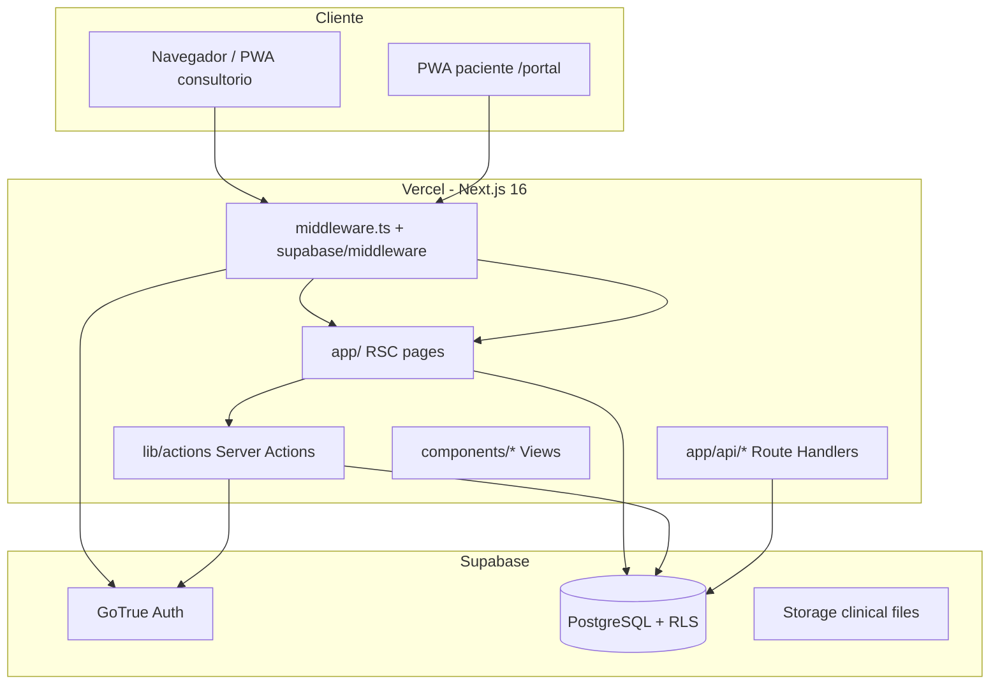

# Informe de arquitectura — DrFlow

**Alcance:** `c:\dev\DrFlow` (Next.js 16 + Supabase + TypeScript)  
**Modo:** solo lectura — no se modificó ningún archivo  
**Versión analizada:** `0.2.0` (`package.json`)

---

## Resumen ejecutivo

DrFlow es un **monolito SaaS multi-tenant** orientado a consultorios argentinos: agenda, pacientes, historia clínica, recetas, PAMI/coberturas, portal paciente PWA y reserva pública. La arquitectura es **Next.js App Router** con **React Server Components** en páginas del dashboard, **Server Actions** para mutaciones, **Supabase** (Auth + Postgres + RLS + Storage) y deploy en **Vercel** (región `gru1`).

Fortalezas: modelo de tenant claro (`clinics` + `clinic_members` + cookie `drflow_clinic_id`), **RLS extensa** en migraciones, matriz de permisos por rol, separación consultorio vs portal (dos service workers), CI con lint/test/build, y documentación operativa (`docs/`).

Debilidades: **lógica duplicada** (auth, URLs públicas), **módulos “god”** (`clinic.ts`), **guards de ruta no aplicados** en middleware/layout, **prueba 30 días solo de marketing** (sin enforcement en BD), sanitización XSS **mínima**, cobertura de tests **acotada a utilidades** (sin E2E ni RLS), y rutas lab (`/pagos`, `/telemedicina`, `/qa`) aún accesibles por URL.

**Puntaje global: 7 / 10** — producto usable y con base sólida para un MVP clínico; falta endurecimiento de seguridad, gobernanza de datos sensibles y escalabilidad operativa antes de crecimiento comercial fuerte.

---

## 1. Arquitectura general

| Capa | Responsabilidad |
|------|-----------------|
| `src/app/` | Rutas, metadata, composición RSC |
| `src/components/` | UI por dominio + `layout/`, `ui/` |
| `src/lib/actions/` | Mutaciones server-side, revalidación |
| `src/lib/services/` | Integraciones mock (pagos, recordatorios, telemedicina) |
| `src/lib/auth/session.ts` | Tenant activo (cookie), shell del dashboard |
| `src/lib/permissions/roles.ts` | RBAC en aplicación |
| `supabase/migrations/` | Esquema, RPC, políticas RLS (001–031) |

**Patrón dominante:** cada página del dashboard repite `getProfile()`, `getUserClinics()`, `getActiveClinicId()` para el `Header`, aunque el layout ya llama `getDashboardShell()` (mitigado parcialmente por `React.cache()` en la misma request, pero el diseño sigue siendo repetitivo).

---

## 2. Tecnologías utilizadas

| Área | Stack |
|------|--------|
| Frontend | React 19, Next.js 16.2.9, Tailwind CSS 4, Lucide |
| Backend / datos | Supabase (SSR `@supabase/ssr`, JS client), PostgreSQL, RLS |
| Validación | Zod 4 |
| Fechas | date-fns 4, date-fns-tz |
| PDF | jsPDF, pdf-parse (import clínico) |
| Tests | Vitest 4, Testing Library, jsdom |
| CI/CD | GitHub Actions, Vercel |
| PWA | Service Workers (`public/sw.js`, `sw-portal.js`) |

Integraciones **reales:** Google OAuth (Supabase), email SMTP (config externa).  
**Simuladas / stub:** Mercado Pago, recordatorios email, REFEPS (`refeps.ts` sin uso), Jitsi URLs.

---

## 3. Función de carpetas importantes

| Carpeta | Función |
|---------|---------|
| `src/app/(dashboard)/` | Panel médico autenticado (agenda, pacientes, HC, etc.) |
| `src/app/(auth)/` | Login, registro, restablecer contraseña |
| `src/app/portal/` | Portal paciente por `slug` + PWA verde |
| `src/app/solicitar-turno/` | Reserva pública |
| `src/app/api/` | Auth form POST, versión, farmacología |
| `src/app/auth/` | Callback OAuth, confirm OTP, complete |
| `src/components/` | Vistas, formularios, layout, manual, updates |
| `src/lib/actions/` | Server Actions por dominio (parcialmente agrupadas en `clinic.ts`) |
| `src/lib/supabase/` | Cliente server/browser, env, middleware, admin |
| `src/lib/manual/`, `app-release.ts` | Manual y changelog/versioning |
| `supabase/migrations/` | Fuente de verdad del esquema y RLS |
| `public/` | Assets, SW, OG, iconos PWA |
| `tests/` | Tests unitarios (15 archivos) |
| `scripts/` | Migraciones, redirects Supabase, checks |
| `docs/` | Deploy, QA, roadmap, setup local |

---

## 4. Código duplicado (detectado)

| Duplicación | Ubicaciones |
|-------------|-------------|
| **Login** | Form → `/api/auth/login` vs `signIn()` en `lib/actions/auth.ts` (**action no usada**) |
| **URLs públicas** | `getSiteUrl` / `getPublicSiteUrl` (`env.ts`) vs lógica inline en `login/page.tsx`, `google-login-button.tsx`, `demo/page.tsx` |
| **Mensajes auth** | `mapAuthError` en `api/auth/login/route.ts` y `lib/actions/auth.ts` |
| **Bootstrap sesión** | ~22 páginas del dashboard repiten fetch de perfil/clínica para `Header` |
| **Sanitización + Zod** | Patrón repetido en `clinic.ts`, `prescriptions.ts`, `public-booking.ts`, etc. (aceptable, no crítico) |
| **Plantillas PAMI demo** | Contenido similar en migraciones `020`/`030` y `pami-cabecera.ts` |

---

## 5. Archivos / símbolos sin uso (probables)

| Item | Evidencia |
|------|-----------|
| `signIn` en `lib/actions/auth.ts` | Login usa API route, no la action |
| `canAccessRoute` en `lib/permissions/roles.ts` | Definida, **nunca importada** |
| `lib/services/refeps.ts` | Sin imports en `src/` |
| `jspdf-autotable` | En `package.json`, sin uso en código |
| SVG boilerplate | `public/next.svg`, `vercel.svg`, etc. |
| Rutas lab | `/telemedicina`, `/pagos`, `/qa` ocultas en nav pero **rutas activas** |

---

## 6. Bugs potenciales

| Severidad | Hallazgo |
|-----------|----------|
| **Alta** | **Prueba 30 días** (`/probar`, `?trial=30`): solo copy en UI; **no hay** `trial_ends_at` ni bloqueo en BD/app |
| **Media** | Middleware: si falla env Supabase, **deja pasar** request con cookie auth (`catch` en middleware) |
| **Media** | `canAccessRoute` bloquea `/qa` en código muerto; **rutas lab siguen abiertas** a quien conozca la URL |
| **Media** | Portal “Mis turnos”: **localStorage** + DNI; fácil desincronización y expectativa incorrecta de sync multi-dispositivo |
| **Baja** | `middleware` usa `getSession()` con timeout 1.2s — sesión stale o redirect inconsistente bajo latencia |
| **Baja** | Invitaciones: mensaje de error puede mencionar `SERVICE_ROLE_KEY` (filtrado a admins, no a pacientes) |
| **Baja** | Docs deploy citan migraciones hasta **020**; repo tiene **031** — riesgo operativo al aplicar migraciones |

---

## 7. Rendimiento

| Tema | Detalle |
|------|---------|
| **N+1 en dashboard** | `dashboard/page.tsx`: muchas queries paralelas (aceptable) pero patrón repetido en todas las páginas |
| **Sin paginación** | Listados largos (pacientes, historias, recetas) con `limit` fijos o listas completas |
| **Prefetch** | `RoutePrefetcher` precarga rutas core (bien para UX dev/prod moderado) |
| **PDF manual** | Generación client-side con jsPDF (OK; no bloquea servidor) |
| **RPC farmacología** | Búsquedas limitadas a 12 resultados (bien) |
| **SW** | Cache mínimo de iconos; **no** offline-first de la app clínica |
| **Imágenes OG** | `og-image.png` optimizado (~300 KB); aceptable para WhatsApp |

---

## 8. Seguridad (OWASP — visión práctica)

| OWASP / tema | Estado |
|--------------|--------|
| **A01 Broken Access Control** | RLS + `hasPermission` en actions/API farmacología; **gap:** layout no aplica `canAccessRoute`; lab routes por URL |
| **A02 Cryptographic** | HTTPS en prod; cookies `secure` en prod (`session.ts`) |
| **A03 Injection** | Supabase client parametrizado; RPC con tipos; bajo riesgo SQL directo en app |
| **A04 Insecure design** | Service role en login diagnostic (`diagnoseLoginFailure`) — solo server, pero amplía superficie si key filtra |
| **A05 Misconfiguration** | Headers parciales en `vercel.json` (falta CSP, HSTS explícito, `X-Frame-Options`) |
| **A07 Auth** | Supabase Auth + OAuth; reset con URL pública (bien); admin enum vía service role en login API |
| **A08 Data integrity** | Server Actions sin CSRF token explícito (Next.js mitiga en parte); forms POST clásicos en login |
| **A09 Logging** | `audit` helper en session; no observabilidad centralizada (Sentry, etc.) |
| **A10 SSRF** | Bajo; pocas salidas HTTP custom |

**XSS:** `sanitizeText` solo quita `<>` y limita longitud — **no** es equivalente a DOMPurify; contenido clínico renderizado como texto en React reduce riesgo, pero no cubre todos los vectores si hubiera `dangerouslySetInnerHTML` (no detectado en grep principal).

**SECURITY DEFINER RPC:** `get_patient_appointment_statuses` exige slug + DNI + IDs de turnos — diseño razonable; riesgo de **enumeración** de IDs si alguien adivina UUIDs (bajo pero existente).

---

## 9. Privacidad y protección de datos (Argentina / salud)

| Tema | Observación |
|------|-------------|
| **Datos sensibles** | HC, DNI, cobertura, recetas en Postgres con RLS |
| **Política** | `/privacidad` menciona Ley 25.326 / 26.529 y RLS |
| **Portal paciente** | Datos en localStorage; aviso de limitación (mejora reciente) |
| **Retención / borrado** | No hay flujo documentado de exportación/borrado total del paciente (Habeas Data) |
| **Subprocesadores** | Supabase + Vercel — conviene listarlos en privacidad/DPA |
| **Logs** | Errores Supabase/auth pueden exponer mensajes técnicos en UI (reducidos en QA reciente) |
| **Trial marketing** | “30 días gratis” sin contrato técnico de expiración — riesgo legal/comercial |

---

## 10. Errores de diseño / arquitectura

1. **RBAC en UI pero no en router:** permisos en sidebar/actions, no en middleware/layout unificado.
2. **God module `clinic.ts`:** pacientes, turnos, HC, mocks mezclados (~500+ líneas).
3. **Dos caminos de login** (API vs action) — deuda y confusión.
4. **Tenant vía cookie** sin rotación explícita al cambiar clínica en todos los flujos (funciona, pero es frágil ante bugs de cache).
5. **Tipos DB manuales** (`types/database.ts`) vs esquema real — drift con migraciones 029–031.
6. **Features “labs”** en producción sin feature flag server-side.

---

## 11. Componentes que conviene dividir

| Módulo | Recomendación |
|--------|----------------|
| `lib/actions/clinic.ts` | Split: `patients.ts`, `appointments.ts`, `clinical-records.ts`, `reminders-payments.ts` |
| `settings-panel.tsx` | Subpaneles: disponibilidad, equipo, links públicos |
| `agenda-view.tsx` | Separar calendario, fila de turno, formulario alta |
| `patient-portal-view.tsx` | Pantallas por archivo (`portal/screens/*`) |
| `register/page.tsx` | Extraer wizard a `components/auth/register-wizard.tsx` |
| Dashboard layout | Proveer `DashboardShellContext` desde layout para evitar refetch en cada página |

---

## 12. Funciones / archivos demasiado grandes

| Líneas (~) | Archivo |
|------------|---------|
| 503+ | `src/lib/actions/clinic.ts` |
| 369 | `src/components/configuracion/settings-panel.tsx` |
| 330 | `src/components/agenda/agenda-view.tsx` |
| 322 | `src/lib/actions/patient-attachments.ts` |
| 318 | `src/components/portal/patient-portal-view.tsx` |
| 305+ | `src/app/(auth)/register/page.tsx` |

---

## 13. Base de datos — revisión

- **31 migraciones** incrementales; núcleo en `001_schema.sql` + `002_rls_policies.sql`.
- **Multi-tenant:** `clinic_id` en entidades clínicas; helpers RLS (`user_clinic_ids`, roles).
- **RPC públicos:** booking, status paciente — revisar grants `anon` en cada migración.
- **Storage** (`028`): archivos clínicos — políticas de bucket críticas para fugas.
- **Riesgos:** migraciones pendientes en prod (030 coberturas, 031 Google name) si no corrieron `migrate:pending`.
- **Índices:** no auditados en detalle en este informe; conviene revisar queries de agenda por `start_at`, `clinic_id`.
- **Seed/demo:** RPC `seed_demo_*` — solo roles autorizados (depende de RLS en RPC).

---

## 14. Autenticación y permisos

| Aspecto | Implementación |
|---------|----------------|
| Auth | Supabase (email/password, Google OAuth) |
| Sesión | Cookies SSR Supabase + cookie `drflow_clinic_id` |
| Roles | `clinic_admin`, `doctor`, `secretary`, `superadmin` |
| App RBAC | `hasPermission` + checks en pages/actions |
| Ruta guard | **Parcial** — middleware solo cookie/sesión, no permisos por ruta |
| Superadmin | Bypass en RLS helpers y permisos |
| Invitaciones | Requiere `SUPABASE_SERVICE_ROLE_KEY` |

**Recomendación:** usar `canAccessRoute` (o equivalente) en `(dashboard)/layout.tsx` antes de renderizar hijos.

---

## 15. APIs

| Endpoint | Auth | Notas |
|----------|------|-------|
| `POST /api/auth/login` | Público | Puede usar service role para diagnóstico |
| `POST /api/auth/reset-password` | Público | Redirect prod |
| `POST /api/auth/signout` | Cookie | OK |
| `GET /api/pharmacology` | User + `viewPharmacology` | Bien protegida |
| `GET /api/version` | Público | OK para PWA updates |
| Server Actions | Sesión Supabase | Patrón principal de mutación |

No hay rate limiting a nivel app (depende de Supabase/Vercel).

---

## 16. Variables de entorno

| Variable | Uso |
|----------|-----|
| `NEXT_PUBLIC_SUPABASE_URL` | Cliente + server |
| `NEXT_PUBLIC_SUPABASE_PUBLISHABLE_KEY` / `ANON_KEY` | Cliente |
| `NEXT_PUBLIC_SITE_URL` | Emails, OG, redirects |
| `NEXT_PUBLIC_APP_VERSION` | Opcional; default `package.json` |
| `SUPABASE_SERVICE_ROLE_KEY` | Admin, invitaciones, login diagnose |
| `DATABASE_URL` | Scripts migración |
| `VERCEL_URL` / `VERCEL_GIT_COMMIT_SHA` | Fallback URL / build id |

**Riesgos:** service role en entorno local compartido; `NEXT_PUBLIC_*` expuesto al browser (esperado para Supabase anon key).

---

## 17. Dependencias

- Stack **moderno** (Next 16, React 19, Tailwind 4, Zod 4).
- **`jspdf-autotable`:** candidata a eliminar si no se usa.
- **`@types/node` ^20** vs CI Node **24** — desalineación menor.
- No se ejecutó `npm outdated` en este informe; conviene correrlo en CI mensual.
- **`pdf-parse` + jsPDF`:** mantener actualizados por CVEs en parsers PDF.

---

## 18. Escalabilidad

| Dimensión | Capacidad actual | Límite |
|-----------|------------------|--------|
| Usuarios concurrentes | Vercel serverless + Supabase | Planes y connection pooling |
| Tenants | RLS escala bien horizontalmente en filas | Muchas clínicas → índices y reporting |
| Archivos clínicos | Supabase Storage | Cuotas y CDN |
| Background jobs | No hay cola (recordatorios mock) | WhatsApp/email real necesitará workers |
| Observabilidad | Logs Vercel/Supabase | Sin APM unificado |
| Multi-región | Solo `gru1` | OK para AR; expansión LATAM = replicación |

---

## Problemas críticos

1. **Control de acceso por URL incompleto** — rutas sensibles/lab accesibles sin guard central.
2. **Prueba comercial “30 días” sin enforcement** — expectativa legal/técnica incumplida si se promete en WhatsApp.
3. **Dependencia de RLS + queries app** — cualquier query sin `clinic_id` + policy débil = fuga cross-tenant (requiere tests automatizados RLS).
4. **Service role en flujos de login** — minimizar o aislar (solo diagnóstico opt-in).

---

## Problemas importantes

1. God file `clinic.ts` y páginas dashboard con bootstrap duplicado.
2. Sanitización XSS superficial (`sanitizeText`).
3. Headers de seguridad incompletos (CSP, HSTS, frame ancestors).
4. Cobertura de tests insuficiente para flujos clínicos y auth.
5. Código muerto (`signIn`, `canAccessRoute`, `refeps`, `jspdf-autotable`).
6. Documentación de migraciones desactualizada vs 031.
7. Portal paciente: identificación solo por DNI + IDs en localStorage.

---

## Mejoras recomendadas

1. **Layout guard:** middleware o `(dashboard)/layout` con matriz ruta → permiso.
2. **Trial real:** columnas `trial_ends_at` / plan en `clinics` + middleware de expiración.
3. **Unificar auth:** una sola vía login; extraer `getPublicSiteUrl()` everywhere.
4. **Split actions** por bounded context.
5. **CSP + security headers** en `next.config` / Vercel.
6. **Tests:** integración RLS (dos tenants), E2E Playwright (login, atender, receta).
7. **Tipos:** `supabase gen types` en CI.
8. **Observabilidad:** Sentry + audit log exportable.
9. **Privacidad:** export/borrado paciente, registro de accesos a HC.
10. **Rate limit** en APIs auth y booking público.

---

## Roadmap priorizado

| Prioridad | Plazo sugerido | Entregable |
|-----------|----------------|------------|
| **P0** | 1–2 semanas | Route guards + eliminar acceso lab por URL; trial DB + banner expiración |
| **P0** | 1–2 semanas | Auditar RLS + tests cross-tenant; aplicar migraciones 030–031 en prod | ✅ Entregado en repo: `docs/RLS_AUDIT.md`, `tests/rls-policies.test.ts`, `npm run migrate:p0`, checks 030–032 |
| **P1** | 2–4 semanas | Refactor `clinic.ts`; contexto shell en layout; unificar site URL/auth | ✅ En repo: split actions, `DashboardPageHeader`, `resolveClientPublicSiteUrl` |
| **P1** | 2–4 semanas | CSP/HSTS; endurecer sanitización campos clínicos |
| **P2** | 1–2 meses | E2E Playwright; Sentry; paginación listados |
| **P2** | 1–2 meses | Portal turnos server-side (token/DNI); quitar localStorage como fuente única |
| **P3** | 3+ meses | Cola recordatorios reales; Mercado Pago; REFEPS si aplica; multi-región si crece |

---

## Puntaje del proyecto: **7 / 10**

| Criterio | Nota (1–10) | Peso |
|----------|-------------|------|
| Arquitectura y claridad | 7 | |
| Seguridad / OWASP | 6 | |
| Privacidad / datos salud | 6.5 | |
| Calidad de código / DRY | 6.5 | |
| Base de datos / multi-tenant | 8 | |
| Tests / CI | 6 | |
| UX producto / honestidad | 7.5 | |
| Escalabilidad operativa | 6.5 | |
| Documentación | 7 | |

**Interpretación:** MVP sólido para consultorio real con equipo que entiende Supabase; **no** listo aún para auditoría formal de salud o escala comercial agresiva sin P0/P1.
