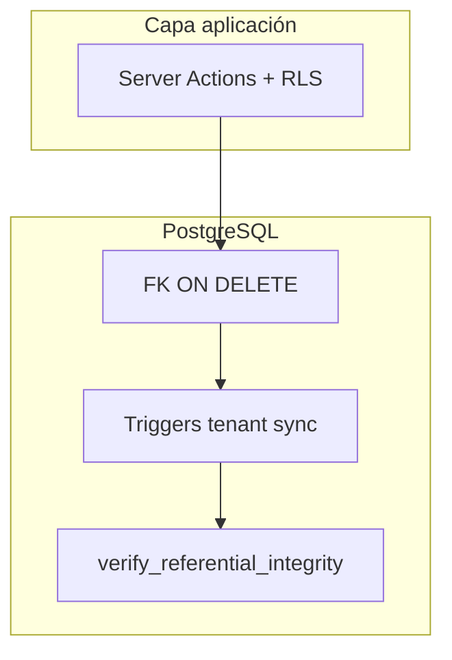

# Informe de Auditoría — Integridad Referencial (PostgreSQL / Supabase)

**Fecha:** 2026-08-04  
**Alcance:** 61 migraciones (`001`–`060`), ~43 tablas con RLS, bucket `clinical-files`  
**Migración entregada:** `060_referential_integrity.sql`  
**Estado:** idempotente, sin DELETE de datos de negocio

---

## Resumen ejecutivo

| Dimensión | Hallazgos | Acción |
|-----------|-----------|--------|
| Foreign keys faltantes | 1 (`clinical_records.template_id`) | FK añadida |
| FK sin `ON DELETE` adecuado | 9+ columnas opcionales | `SET NULL` / `CASCADE` |
| Relaciones cross-tenant | `clinic_id` ≠ `patients.clinic_id` en hijos | UPDATE sync + triggers |
| Registros huérfanos | appointment/template/clinical_record pointers | NULL (preserva fila) |
| Restricciones incorrectas | `payments.patient_id` bloqueaba purge | `ON DELETE CASCADE` |
| Verificación post-migración | — | `verify_referential_integrity()` |

---

## Metodología

1. Análisis estático de `001_schema.sql` y migraciones `002`–`059`
2. Cruce con `DATABASE_REPORT.md` (054 FK fixes) y código app (`clinic_id` tenant key)
3. Clasificación: **P0** (integridad rota), **P1** (cascade incorrecto), **P2** (preventivo)
4. Migración idempotente: cleanup → constraints → triggers → función de verificación
5. Tests: `tests/referential-integrity-migration.test.ts`

---

## 1. Foreign keys faltantes

| Tabla | Columna | Problema | Fix 060 |
|-------|---------|----------|---------|
| `clinical_records` | `template_id` | UUID sin FK — referencias huérfanas posibles | `REFERENCES clinical_templates(id) ON DELETE SET NULL` |

**Nota:** Otras columnas legacy (`clinical_records.professional_id` NOT NULL) mantienen `NO ACTION` intencionalmente — impide borrar profesional con HC (retención clínica).

---

## 2. Relaciones inconsistentes (cross-tenant)

Patrón de riesgo: tablas con `(clinic_id, patient_id)` donde `clinic_id` puede desincronizarse de `patients.clinic_id` (imports, bugs históricos, migración 047 PHI).

### Tablas corregidas (UPDATE sync)

| Tabla |
|-------|
| `patient_attachments` |
| `patient_admin_documents` |
| `clinical_records` |
| `prescription_drafts` |
| `medical_orders` |
| `appointments` |
| `consent_records` |
| `patient_app_share_log` |
| `patient_clinical_profiles` |
| `cash_charges`, `patient_ledger_entries`, `cash_invoices` (si existen) |

### Triggers preventivos (060)

| Trigger | Función | Comportamiento |
|---------|---------|----------------|
| `trg_*_patient_clinic` | `enforce_patient_clinic_consistency()` | Auto-alinea `clinic_id` al del paciente en INSERT/UPDATE |
| `trg_clinic_members_professional_clinic` | `enforce_clinic_member_professional()` | Rechaza `professional_id` de otra clínica |

**Sin pérdida de datos:** solo corrección de columna tenant; no se eliminan filas.

---

## 3. Registros huérfanos (reparación)

| Check | Acción | Datos |
|-------|--------|-------|
| `clinical_records.appointment_id` → turno inexistente | `SET NULL` | HC preservada |
| `prescription_drafts.clinical_record_id` → HC borrada | `SET NULL` | Receta preservada |
| `clinical_records.template_id` → template borrado | `SET NULL` | HC preservada |
| `appointments.rescheduled_from` → turno origen borrado | `SET NULL` | Turno preservado |
| `clinic_members.professional_id` cross-clinic | `SET NULL` | Membresía preservada |
| `public_booking_links.professional_id` inválido | `SET NULL` | Link preservado |
| `audit_logs.patient_id` / `clinical_record_audit.patient_id` | `SET NULL` | Audit trail preservado |

---

## 4. Restricciones FK corregidas (`ON DELETE`)

| FK | Antes | Después | Razón |
|----|-------|---------|-------|
| `prescription_drafts.clinical_record_id` | NO ACTION | **SET NULL** | Borrar HC no debe bloquear recetas |
| `payments.patient_id` | NO ACTION | **CASCADE** | Purga clínica/paciente consistente |
| `appointments.location_id` | NO ACTION | **SET NULL** | Borrar sede no bloquea turnos |
| `appointments.specialty_id` | NO ACTION | **SET NULL** | Idem especialidad |
| `appointments.consultation_reason_id` | NO ACTION | **SET NULL** | Idem motivo |
| `appointments.rescheduled_from` | NO ACTION | **SET NULL** | Self-ref segura |
| `availability_rules.location_id` | NO ACTION | **SET NULL** | Agenda preservada |
| `public_booking_links.professional_id` | NO ACTION | **SET NULL** | Portal sigue activo |
| `cash_charges.charge_type_id` / `payment_method_id` | NO ACTION | **SET NULL** | Catálogo caja (034) |

### Ya corregidas en 054 (referencia)

- `clinical_records.appointment_id` → SET NULL  
- `reminder_logs.appointment_id` → SET NULL  
- `payments.appointment_id` → SET NULL  

### Intencionalmente sin cambio

| FK | Motivo |
|----|--------|
| `clinical_records.professional_id` NOT NULL | Retención legal — bloquea delete profesional con HC |
| `medical_orders.professional_id` NOT NULL | Idem órdenes médicas |
| `telemedicine_sessions.appointment_id` CASCADE | Sesión muere con turno (correcto) |

---

## 5. Verificación de integridad

Ejecutar post-migración (SQL Editor o psql):

```sql
SELECT * FROM verify_referential_integrity();
```

| check_name | Esperado |
|------------|----------|
| `patient_clinic_mismatch` | 0 |
| `clinical_record_orphan_appointment` | 0 |
| `prescription_orphan_clinical_record` | 0 |
| `clinical_record_orphan_template` | 0 |
| `clinic_member_cross_clinic_professional` | 0 |
| `audit_log_orphan_patient` | 0 |

Si algún contador > 0, re-ejecutar `060` (idempotente) o investigar fila puntual.

---

## 6. Diagrama de capas de integridad



---

## 7. Backlog residual (no incluido en 060)

| ID | Prioridad | Item |
|----|-----------|------|
| RI-P1 | P1 | FK compuesta `(patient_id)` + CHECK subquery en tablas sin trigger |
| RI-P2 | P2 | `NOT VALID` + `VALIDATE CONSTRAINT` en prod grande (reduce lock) |
| RI-P3 | P2 | `FORCE ROW LEVEL SECURITY` en tablas PHI |
| RI-P4 | P3 | Eliminar `clinical_record_attachments` (latente) o wire-up |
| RI-P5 | P3 | `pg_stat_statements` + monitoreo FK violations en logs |

---

## 8. Tests y despliegue

```bash
npm run test -- tests/referential-integrity-migration.test.ts tests/database-audit-migration.test.ts
```

**Despliegue Supabase:**

1. Aplicar `060_referential_integrity.sql` en SQL Editor (o `supabase db push`)
2. Ejecutar `SELECT * FROM verify_referential_integrity();`
3. Confirmar todos `violation_count = 0`

**Rollback:** Revertir FKs requiere re-aplicar definiciones previas; los UPDATE de sync **no** se revierten automáticamente (mejora de datos).

---

## Conclusión

La migración **060** cierra gaps de integridad referencial detectados tras 054/057: FK faltante en templates, cascadas en referencias opcionales, reparación de huérfanos sin DELETE, y triggers que previenen futura deriva cross-tenant. La función `verify_referential_integrity()` permite validar el estado final de forma repetible.
