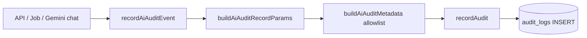

# Fase 5 — Auditoría IA en base de datos (Argentina)

**Proyecto:** DrFlow  
**Rama:** `compliance/argentina-monetization`  
**Fecha:** 2026-08-23  
**Alcance:** Staging/local. No certifica cumplimiento legal.

## Objetivo

Registrar en `audit_logs` (inmutable, multi-tenant) **cada uso de IA clínica u operativa** con metadata mínima: quién, cuándo, consultorio, paciente (si aplica), proveedor, éxito/fallo y estado de sanitización — **sin prompts, respuestas ni contenido clínico**.

## Arquitectura



| Capa | Archivo |
|------|---------|
| API IA clínica | `src/app/api/clinical-ai/route.ts` |
| Gemini clínico | `src/lib/ai/run-gemini-clinical.server.ts` |
| Jobs async | `src/core/jobs/handlers/run-ai-task.ts` |
| Admin ops (rule-based) | `src/app/api/admin-ops-ai/route.ts` |
| Servicio central | `src/core/compliance/ai-audit.ts` |
| Writer inmutable | `src/core/security/audit-service.ts` → `audit_logs` |

## Campos persistidos

| Campo `audit_logs` | Valor IA |
|--------------------|----------|
| `module` | `ia` |
| `entity_type` | `ai_request` |
| `entity_id` | feature (`gemini_clinical_chat`, `clinical_ai_byok`, …) |
| `what` | `ai.<feature>` |
| `patient_id` | UUID paciente si aplica |
| `user_id` | Sesión API o `clinic_jobs.created_by` en jobs |
| `metadata` | Solo allowlist (ver abajo) |

### Metadata allowlist (`AI_AUDIT_METADATA_ALLOWLIST`)

- `provider`, `model`, `task`
- `success`, `sanitization_status`, `redaction_count`
- `error_code`, `duration_ms`

**Prohibido por diseño:** `prompt`, `response`, `message`, `body`, `content`, texto clínico.

### Códigos de error estables

| Código | Significado |
|--------|-------------|
| `sanitization_blocked` | Fail-safe Fase 4 — no salió a proveedor externo |
| `no_model_response` | Proveedor sin respuesta útil |
| `provider_error` | Error del proveedor (reservado) |

## Features auditadas

| `feature` | Origen | `provider` típico |
|-----------|--------|-------------------|
| `gemini_clinical_chat` | Copilot Gemini/Vertex | `vertex_gemini` / `gemini_api` |
| `clinical_ai_byok` | BYOK en `/api/clinical-ai` | `openai`, `anthropic`, … |
| `clinical_ai_job` | Job `run_ai_task` | `openai_compatible` / `rule_based` |
| `admin_ops_ai` | Dashboard ops (sin LLM externo) | `rule_based` |
| `clinical_ai_api` | Reservado para orquestador API |

## Consulta SQL (staging / admin)

```sql
SELECT
  created_at,
  user_id,
  patient_id,
  entity_id AS feature,
  metadata->>'provider' AS provider,
  metadata->>'task' AS task,
  metadata->>'success' AS success,
  metadata->>'sanitization_status' AS sanitization,
  metadata->>'error_code' AS error_code,
  metadata->>'redaction_count' AS redactions
FROM audit_logs
WHERE clinic_id = :clinic_id
  AND module = 'ia'
ORDER BY created_at DESC
LIMIT 100;
```

Índice existente: `idx_audit_logs_module_created (clinic_id, module, created_at DESC)` — migración `055_immutable_audit_logging.sql`.

## Corrección Fase 5 — jobs sin sesión HTTP

`recordAudit` requiere `user_id`. Los jobs `run_ai_task` ahora pasan `userId: job.created_by` para no perder trazabilidad cuando el worker no tiene cookie de sesión.

## Tests

```bash
npx vitest run tests/ai-audit.test.ts
npx tsc --noEmit
```

Cubre: allowlist PHI, forma de fila `audit_logs`, delegación a `recordAudit`, módulo `ia`.

## Veredicto técnico Fase 5

**Implementado:** auditoría centralizada, metadata allowlist, actor en jobs, admin ops auditado, tests de contrato DB.

**Pendiente operativo:** panel UI de auditoría IA para admins; retención/archivo según política del consultorio; revisión legal de campos expuestos a admins.

**No afirmar:** cumplimiento AAIP solo por existencia de logs técnicos.
