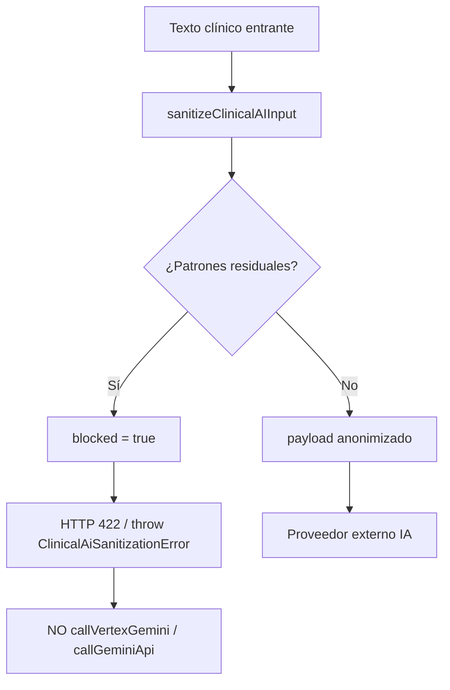

# Fase 4 — Fail-safe IA clínica (Argentina)

**Proyecto:** DrFlow  
**Rama:** `compliance/argentina-monetization`  
**Fecha:** 2026-08-22  
**Alcance:** Staging/local únicamente. No implica cumplimiento legal por sí solo.

## Objetivo

Garantizar que **ningún texto con identificadores residuales** salga hacia proveedores externos de IA (Vertex/Gemini/BYOK). Si la sanitización no puede anonimizar por completo, la solicitud se **bloquea** con respuesta controlada HTTP 422.

## Componentes

| Módulo | Rol |
|--------|-----|
| `src/lib/ai/clinical-ai-failsafe.ts` | Código estable `sanitization_blocked`, `ClinicalAiSanitizationError`, `assertSafeForExternalClinicalAi()`, `clinicalAiSanitizationFailureResponse()` |
| `src/lib/ai/sanitize-clinical-ai-input.ts` | Redacción DNI, CUIT/CUIL, email, teléfono, dirección, credencial; `hasResidualClinicalPii()` |
| `src/lib/ai/external-clinical-ai-gateway.server.ts` | Único punto de salida HTTP: `prepareExternalClinicalAiPayload`, `callVertexGeminiSanitized`, `callGeminiApiSanitized` |
| `src/app/api/clinical-ai/route.ts` | API devuelve `{ code, error }` en 422 |
| `src/lib/ai/run-gemini-clinical.server.ts` | Flujo Gemini clínico vía gateway |
| `src/lib/utils/clinical-ai-llm-provider.server.ts` | BYOK vía gateway + `strictSanitization` |
| `src/core/jobs/handlers/run-ai-task.ts` | Jobs async sanitizados antes de IA |

## Flujo fail-safe



## Respuesta API bloqueada

```json
{
  "code": "sanitization_blocked",
  "error": "No se pudo anonimizar completamente el texto antes de enviarlo al proveedor de IA..."
}
```

## Caso de prueba argentino (sintético)

Texto de médico con nombre, DNI, CUIL, domicilio, teléfono, email y credencial OSDE → todos redactados; contenido clínico (p. ej. DM2) preservado. Estado `partial`, no `blocked`.

## Tests

- `tests/clinical-ai-failsafe.test.ts` — redacción compuesta AR + **mock Vertex/Gemini no invocado** si `blocked`
- `tests/sanitize-clinical-ai-input.test.ts` — patrones unitarios
- `tests/external-clinical-ai-gateway.test.ts` — gateway y contexto

Ejecutar:

```bash
npx vitest run tests/clinical-ai-failsafe.test.ts tests/external-clinical-ai-gateway.test.ts tests/sanitize-clinical-ai-input.test.ts
npx tsc --noEmit
```

## Pendientes (fases siguientes)

- Auditoría DB de eventos IA (`recordAiAuditEvent`) — Fase 5
- Revisión legal de mensajes al usuario final
- Validación con datos reales anonimizados en staging

## Veredicto técnico Fase 4

**Implementado:** fail-safe centralizado, código de error estable, bloqueo antes de HTTP externo, tests con verificación de no-llamada al proveedor.

**No afirmar:** cumplimiento AAIP/Ley 25.326 solo por esta capa técnica.
