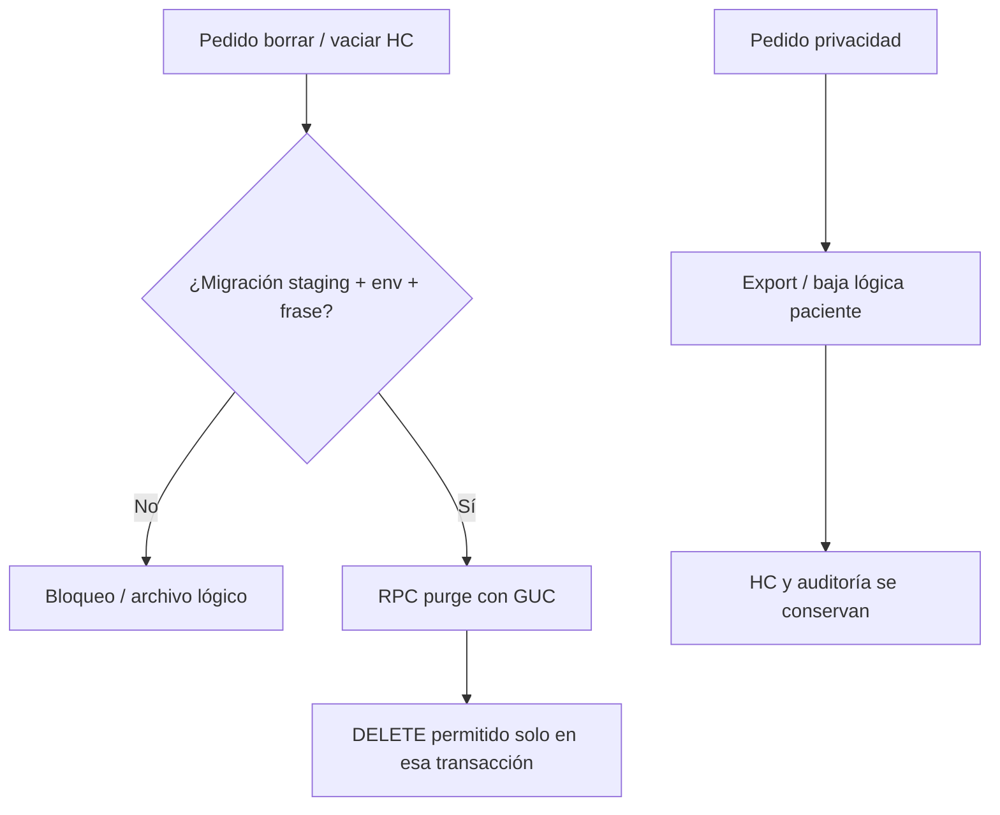

# Fase 7 — Protección contra borrado de historia clínica

**Proyecto:** DrFlow  
**Rama:** `compliance/argentina-monetization`  
**Fecha:** 2026-08-23  
**Alcance:** Staging/local. **No constituye asesoramiento legal.**

## Objetivo (PHASE 7)

Revisar operaciones de borrado que afecten información clínica y **impedir hard-delete accidental o no autorizado** mientras existan obligaciones de retención.

Preferir: `archived` / `superseded` / `corrected` (baja lógica) frente a destrucción física.

## Distinción clave: privacidad ≠ retención clínica

| Derechos de privacidad (Ley 25.326 / habeas data) | Obligaciones de retención clínica (Ley 26.529 / HCE) |
|---------------------------------------------------|------------------------------------------------------|
| Acceso, rectificación, oposición, exportación | Conservar HC el mínimo legal configurable |
| Pueden exigir limitar tratamiento no necesario | **No** autorizan destruir HC por un “borrado” genérico |
| Producto: exportar / anonimizar contactos / baja lógica de ficha | Producto: conservar consultas, recetas emitidas y auditoría |

**Regla de producto:** un pedido de privacidad **no** dispara automáticamente hard-delete de registros clínicos que el prestador debe conservar.

## Mecanismos implementados

| Control | Implementación |
|---------|----------------|
| Sin política RLS DELETE en `clinical_records` | Ya existía (solo SELECT/INSERT/UPDATE) |
| Trigger anti hard-delete | `prevent_clinical_hard_delete` en `clinical_records` |
| Audit inmutable con escape de migración | `prevent_audit_mutation` respeta GUC `app.allow_clinical_hard_delete` |
| Recetas emitidas | Trigger bloquea DELETE si no es `draft` / tiene número / `issued_at` |
| Lifecycle soft | Columnas `lifecycle_status`, `archived_at`, `archived_by`, `archive_reason` |
| RPC archivo | `archive_clinical_record(...)` |
| Purge solo migración | `purge_clinic_clinical_data_for_migration` + env `ALLOW_CLINICAL_HISTORY_RESET=true` |
| Baja de paciente | Soft-delete (`is_active` / `deactivated_at`) — **no** borra HC |

## Flujo



## Paths auditados

| Path | Comportamiento Fase 7 |
|------|------------------------|
| UI “Dar de baja paciente” | Baja lógica + ack de retención |
| Edición SOAP | Update + audit (Fase 6 versionado) |
| `archiveClinicalRecord` | Lifecycle sin borrado físico |
| `clearClinicClinicalHistory` | Solo si env + frase; usa RPC purge |
| Service role DELETE directo | Bloqueado por trigger (salvo RPC) |

## Archivos

| Archivo | Rol |
|---------|-----|
| `supabase/migrations/131_clinical_deletion_protection.sql` | Triggers, lifecycle, RPCs |
| `src/core/compliance/clinical-deletion-protection.ts` | Helpers + matriz privacidad/retención |
| `src/lib/actions/clinical-reset.ts` | Gate env + RPC purge |
| `src/features/historias/actions/clinical-records.ts` | `archiveClinicalRecord` |
| `tests/clinical-deletion-protection.test.ts` | Contrato migración + helpers |

## Tests

```bash
npx vitest run tests/clinical-deletion-protection.test.ts tests/data-retention-policy.test.ts
npx tsc --noEmit
```

## Pendientes / límites

- UI dedicada de “Archivar consulta” en ficha (RPC lista)
- Política operativa de retención post-plazo (destrucción certificada) — fuera de app
- Firma digital / custodia legal externa — no cubierta aquí

## Veredicto técnico Fase 7

**Implementado:** hard-delete de HC bloqueado por defecto; archivo lógico; purge solo migración con doble gate; distinción documentada privacidad vs retención.

**No afirmar:** cumplimiento legal completo ni autorización para destruir HC en producción comercial.
