# Mapa de flujo de datos — DrFlow Argentina (Fase 2)

> **Estado:** Documento técnico de auditoría — no constituye asesoramiento legal.
> **Versión:** 2.0 — Fase 2 completa
> **Fecha:** 2026-08-22
> **Rama:** `compliance/argentina-monetization`
> **Repositorio:** `DrFlow-staging`

**Regla:** Toda afirmación sobre ubicación, retención, DPA o rol legal no verificada en contrato/documentación externa está marcada como `REQUIERE VERIFICACIÓN`.

---

## 1. Resumen ejecutivo

DrFlow es un SaaS multi-tenant para consultorios médicos en Argentina. El límite de aislamiento es `clinic_id`. Los datos primarios (pacientes, historias clínicas, recetas, adjuntos, auditoría) residen en **Supabase** (PostgreSQL + Auth + Storage). La aplicación se ejecuta en **Vercel** (Next.js 16).

Los datos personales y de salud pueden salir de la infraestructura principal de DrFlow hacia **12 categorías de destinos externos** identificados en código, más salidas **client-side** (navegador del usuario) que DrFlow no controla server-side.

---

## 2. Modelo de roles (Ley 25.326 / práctica SaaS)

| Rol | Quién | Relación con datos |
|-----|-------|-------------------|
| **Titular** | Paciente | Dueño de sus datos personales |
| **Responsable del tratamiento** | Consultorio médico (Cliente) | Decide finalidades y bases legales |
| **Encargado del tratamiento** | DrFlow (operador SaaS) | Procesa por cuenta del consultorio |
| **Subprocesadores** | Supabase, Vercel, Google, etc. | Procesan por cuenta de DrFlow |

> La asignación responsable/encargado está documentada en términos y privacidad in-app, pero **REQUIERE REVISIÓN DE ABOGADO** antes de uso comercial.

---

## 3. Diagrama de flujo principal

```mermaid
flowchart TB
  subgraph actores [Actores]
    PAC[Paciente]
    MED[Profesional de salud]
    ADM[Administrador consultorio]
  end

  subgraph drflow [DrFlow - Vercel]
    APP[Next.js App + API Routes]
    MW[Middleware sesión/CSRF]
  end

  subgraph primario [Almacenamiento primario]
    SB[(Supabase PostgreSQL)]
    SA[Supabase Auth]
    ST[Supabase Storage clinical-files]
  end

  subgraph ia [IA - opcional]
    VTX[Google Vertex AI]
    GEM[Gemini API]
    BYOK[OpenAI / Anthropic / BYOK]
  end

  subgraph comercial [Comercial]
    MP[Mercado Pago]
  end

  subgraph mensajeria [Mensajería]
    EM[Resend / SMTP]
    WA[Meta WhatsApp Cloud API]
  end

  subgraph salud_digital [Salud digital - opcional]
    RF[REFEPS API]
    JIT[Jitsi meet.jit.si]
    DLY[Daily.co]
  end

  subgraph observabilidad [Observabilidad - opcional]
    SEN[Sentry]
    OBS[clinic_observability_events - interno]
  end

  subgraph integradores [Integradores clínica]
    API[API pública v1]
  end

  subgraph cliente [Salida client-side]
    WAME[wa.me / mailto]
    STT[Web Speech API navegador]
  end

  PAC --> APP
  MED --> APP
  ADM --> APP
  APP --> MW
  MW --> SB
  MW --> SA
  MW --> ST

  APP -->|texto sanitizado| VTX
  APP -->|texto sanitizado| GEM
  APP -->|texto sanitizado| BYOK

  APP -->|suscripción SaaS| MP
  APP -->|notificaciones| EM
  APP -->|recordatorios| WA
  APP -->|recetas| RF
  APP -->|telemedicina| JIT
  APP -->|telemedicina| DLY
  APP -->|errores| SEN
  APP -->|métricas| OBS
  APP -->|API key| API

  APP -->|UI share| WAME
  APP -->|dictado| STT
```

---

## 4. Flujos por actor

### 4.1 Paciente

| Acción | Datos involucrados | Destinos |
|--------|-------------------|----------|
| Solicitar turno web (`/solicitar-turno/[slug]`) | DNI, nombre, teléfono, email, motivo | → Supabase (RPC `submit_public_booking`); consentimiento vía `record_patient_data_consent` |
| Portal paciente (`/portal/[slug]`) | DNI para consulta turnos | → Supabase (solo lectura tenant) |
| Videoconsulta (`/videoconsulta/[sessionId]`) | Audio/video, nombre display | → Jitsi o Daily.co (embed) |
| Recibir WhatsApp recordatorio | Nombre, fecha turno | → Meta API o wa.me (operador) |
| Recibir email recordatorio | Nombre, fecha turno | → Resend/SMTP |

**Archivos clave:** `public-booking.ts`, `patient-portal-view.tsx`, `telemedicine.ts`, `reminder-whatsapp.ts`, `reminder-email.ts`

### 4.2 Profesional de salud

| Acción | Datos involucrados | Destinos |
|--------|-------------------|----------|
| Registrar consulta (HC) | Motivo, diagnóstico, evolución, indicaciones | → Supabase (`clinical_records` + `clinical_record_audit`) |
| Emitir receta | Medicación, diagnóstico, DNI paciente | → Supabase; opcional → REFEPS API |
| Compartir receta WhatsApp/email | Nombre, diagnóstico, medicación | → **Cliente** abre wa.me/mailto (no server DrFlow) |
| Usar asistente IA (`/gemini`, copilot) | Texto clínico, consulta médico | → Vertex/Gemini/BYOK **tras sanitización** |
| Dictado por voz | Audio clínico | → **Navegador** (Web Speech API) |
| Exportar HC | PHI completo | → Descarga local del profesional |
| Telemedicina | Video consulta | → Jitsi/Daily |

**Archivos clave:** `clinical-records.service.ts`, `prescriptions.service.ts`, `clinical-ai/route.ts`, `run-gemini-clinical.server.ts`, `share-prescription-buttons.tsx`, `use-speech-to-text.ts`

### 4.3 Administrador del consultorio

| Acción | Datos involucrados | Destinos |
|--------|-------------------|----------|
| Invitar miembro equipo | Email, contraseña temporal | → Resend/SMTP |
| Configurar plan / pagar | Datos facturación | → Mercado Pago |
| Export masivo datos | PHI completo | → Supabase staging storage → descarga |
| Configurar API keys | — | Integrador externo consume API v1 |
| Configurar BYOK IA | API key proveedor | → DB Supabase (cifrada en app) + proveedor IA |

---

## 5. Inventario de categorías de datos

| Categoría | Tablas / ubicación | PHI | PII |
|-----------|-------------------|-----|-----|
| Demografía paciente | `patients` | No | Sí (DNI, nombre, email, tel, dirección) |
| Historia clínica | `clinical_records`, `clinical_record_audit` | **Sí** | Posible en texto libre |
| Perfil clínico extendido | `patient_clinical_profiles` | **Sí** | — |
| Recetas | `prescription_drafts`, `prescription_events` | **Sí** | Sí (vinculado a paciente) |
| Turnos | `appointments` | Parcial (motivo) | Sí |
| Consentimientos | `consent_records` | Parcial | Sí |
| Adjuntos | Storage `clinical-files` | **Sí** | Posible |
| Auditoría | `audit_logs`, `clinical_record_audit` | **Sí** (snapshots) | Sí |
| Cuentas usuario | `profiles`, Supabase Auth | No | Sí |
| Facturación SaaS | `clinic_subscriptions`, `clinic_subscription_payments` | No | Sí (email pagador) |
| Credenciales IA BYOK | `user_ai_connections`, `clinic_shared_ai_connections` | No (keys) | — |

---

## 6. Registro de procesadores externos

Cada entrada incluye los campos exigidos por Fase 2. Fuente canónica en código: `src/core/compliance/subprocessors.ts`.

---

### 6.1 Supabase Inc.

| Campo | Valor |
|-------|-------|
| **Datos transmitidos** | Todos los datos de la aplicación: pacientes, HC, recetas, turnos, consentimientos, auditoría, adjuntos, credenciales auth, observabilidad interna |
| **Propósito** | Base de datos PostgreSQL, autenticación (Supabase Auth), almacenamiento de archivos (`clinical-files`) |
| **Rol comercial/legal** | Subprocesador / encargado infraestructura — `REQUIERE VERIFICACIÓN` contractual |
| **Ubicación almacenamiento** | `REQUIERE VERIFICACIÓN` — proyectos: staging `gprmsufvhabntbrytwyi`, producción `nipqdarduknydqptqzup` |
| **Retención** | Según plan Supabase + backups automáticos — `REQUIERE VERIFICACIÓN` |
| **Datos de salud** | **Sí** |
| **PII** | **Sí** |
| **Transferencia internacional** | **Posible** — depende de región del proyecto |
| **Configuración** | `NEXT_PUBLIC_SUPABASE_URL`, `NEXT_PUBLIC_SUPABASE_PUBLISHABLE_KEY`, `SUPABASE_SERVICE_ROLE_KEY` (server-only) |
| **Archivos** | `src/core/supabase/`, migraciones `supabase/migrations/` |
| **Remediación** | Firmar DPA; confirmar región; auditar RLS periódicamente; no usar service role sin validación tenant |

---

### 6.2 Vercel Inc.

| Campo | Valor |
|-------|-------|
| **Datos transmitidos** | Requests HTTP/HTTPS, cookies de sesión en tránsito, headers, posibles logs de función serverless |
| **Propósito** | Hosting Next.js, edge middleware, ejecución API routes y server actions |
| **Rol** | Subprocesador infraestructura |
| **Ubicación** | `REQUIERE VERIFICACIÓN` — región de compute Vercel del proyecto `drflow-app` |
| **Retención** | Según política logs Vercel — `REQUIERE VERIFICACIÓN` |
| **Datos de salud** | Posible en tránsito (no almacenamiento primario) |
| **PII** | Posible en tránsito |
| **Transferencia internacional** | **Posible** |
| **Configuración** | `vercel.json`, despliegue Vercel, `VERCEL_ENV` |
| **Archivos** | `next.config.ts`, `src/core/security/response-headers.ts`, `src/middleware.ts` |
| **Remediación** | DPA Vercel; minimizar PHI en logs; no loguear payloads clínicos |

---

### 6.3 Google Cloud — Vertex AI

| Campo | Valor |
|-------|-------|
| **Datos transmitidos** | System prompt clínico, mensajes sanitizados, contexto HC anonimizado (`PACIENTE_A`), estadísticas consultorio tokenizadas, historial chat (16 turnos máx.) |
| **Propósito** | Asistente clínico Gemini (preferido cuando está configurado) |
| **Rol** | Subprocesador IA |
| **Ubicación** | `VERTEX_AI_LOCATION` (default `us-central1` en `.env.example`) — **típicamente EE.UU.** |
| **Retención** | Según política Google Cloud / Vertex — `REQUIERE VERIFICACIÓN` |
| **Datos de salud** | **Sí** (texto clínico anonimizado, no eliminado) |
| **PII** | Mitigado — `sanitizeClinicalAIInput()` + fail-safe 422 |
| **Transferencia internacional** | **Sí** (si región fuera de Argentina) |
| **Configuración** | `VERTEX_AI_PROJECT`, `VERTEX_AI_LOCATION`, `VERTEX_AI_MODEL`, `VERTEX_AI_SERVICE_ACCOUNT_JSON` |
| **Endpoint** | `https://{location}-aiplatform.googleapis.com/v1/projects/.../generateContent` |
| **Archivos** | `src/lib/ai/vertex-gemini.server.ts`, `run-gemini-clinical.server.ts`, `sanitize-clinical-ai-input.ts` |
| **Remediación** | DPA Google Cloud; evaluar región; base legal transferencia; no enviar si sanitización falla |

---

### 6.4 Google — Gemini API (fallback)

| Campo | Valor |
|-------|-------|
| **Datos transmitidos** | Idem Vertex |
| **Propósito** | Fallback cuando Vertex no está configurado pero `GEMINI_API_KEY` sí |
| **Rol** | Subprocesador IA |
| **Ubicación** | `REQUIERE VERIFICACIÓN` |
| **Retención** | `REQUIERE VERIFICACIÓN` |
| **Datos de salud** | **Sí** (anonimizado) |
| **PII** | Mitigado |
| **Transferencia internacional** | **Posible** |
| **Configuración** | `GEMINI_API_KEY`, `GOOGLE_GENERATIVE_AI_API_KEY` |
| **Endpoint** | `https://generativelanguage.googleapis.com/v1beta/models/...:generateContent` |
| **Archivos** | `src/lib/ai/vertex-gemini.server.ts` (`callGeminiApi`) |
| **Remediación** | Idem Vertex; API key en query string — rotar si se expone |

---

### 6.5 Proveedores IA BYOK (OpenAI, Anthropic, compatible)

| Campo | Valor |
|-------|-------|
| **Datos transmitidos** | Mensajes chat sanitizados, context summary sanitizado, borradores rule-based |
| **Propósito** | IA con credenciales propias del usuario o clínica |
| **Rol** | Elegido por la clínica — responsabilidad compartida |
| **Ubicación** | Según proveedor y `baseUrl` configurado |
| **Retención** | Según proveedor — `REQUIERE VERIFICACIÓN` |
| **Datos de salud** | **Sí** |
| **PII** | Mitigado server-side |
| **Transferencia internacional** | **Típicamente sí** (OpenAI/Anthropic EE.UU.) |
| **Configuración** | Tablas `user_ai_connections`, `clinic_shared_ai_connections`; env `CLINICAL_AI_LLM_*` |
| **Endpoints** | `api.openai.com`, `api.anthropic.com`, `generativelanguage.googleapis.com`, URL custom |
| **Archivos** | `clinical-ai-llm-provider.server.ts`, `user-ai-credentials.server.ts`, `clinic-shared-ai.server.ts` |
| **Remediación** | Aviso IA al usuario; clínica responsable de DPA con su proveedor |

---

### 6.6 Mercado Pago (MercadoLibre S.R.L.)

| Campo | Valor |
|-------|-------|
| **Datos transmitidos** | Plan, ciclo, `external_reference` (clinicId:planId:cycle), monto, email pagador (en respuesta API), payment ID |
| **Propósito** | Cobro suscripción SaaS vía Checkout Pro |
| **Rol** | Procesador de pagos |
| **Ubicación** | Argentina (operación local MP) |
| **Retención** | Según MP — `REQUIERE VERIFICACIÓN` |
| **Datos de salud** | **No** |
| **PII** | **Sí** (email pagador, datos transacción) |
| **Transferencia internacional** | `REQUIERE VERIFICACIÓN` |
| **Configuración** | `MP_ACCESS_TOKEN`, `MP_PUBLIC_KEY`, `MP_WEBHOOK_SECRET` |
| **Endpoints** | `api.mercadopago.com/checkout/preferences`, `api.mercadopago.com/v1/payments/{id}` |
| **Archivos** | `src/core/billing/mercadopago.ts`, `subscription-service.ts`, webhook `api/billing/webhooks/mercadopago/route.ts` |
| **Remediación** | HMAC webhook ✅; validar monto vs catálogo ✅ (Fase 19); secret obligatorio en prod ✅ |

---

### 6.7 Email — Resend

| Campo | Valor |
|-------|-------|
| **Datos transmitidos** | Dirección destino, asunto, cuerpo (nombres, fechas turno, **contraseña temporal en invitaciones**) |
| **Propósito** | Email transaccional (alternativa a SMTP) |
| **Rol** | Subprocesador |
| **Ubicación** | `REQUIERE VERIFICACIÓN` (Resend Inc., típicamente EE.UU.) |
| **Retención** | `REQUIERE VERIFICACIÓN` |
| **Datos de salud** | Bajo (turnos, no HC completa) |
| **PII** | **Sí** |
| **Transferencia internacional** | **Posible** |
| **Configuración** | `RESEND_API_KEY`, `EMAIL_FROM` |
| **Endpoint** | `https://api.resend.com/emails` |
| **Archivos** | `src/lib/services/transactional-email.ts`, `invitations.ts`, `reminder-email.ts` |
| **Remediación** | Eliminar contraseña en texto plano de invitaciones; minimizar PHI |

---

### 6.8 Email — SMTP (alternativa)

| Campo | Valor |
|-------|-------|
| **Datos transmitidos** | Idem Resend |
| **Propósito** | Email transaccional vía servidor SMTP del cliente/operador |
| **Rol** | Subprocesador (depende del host) |
| **Ubicación** | Según `SMTP_HOST` — ej. Hostinger: `REQUIERE VERIFICACIÓN` |
| **Retención** | Según proveedor SMTP |
| **Datos de salud** | Bajo |
| **PII** | **Sí** |
| **Transferencia internacional** | `REQUIERE VERIFICACIÓN` |
| **Configuración** | `SMTP_HOST`, `SMTP_PORT`, `SMTP_USER`, `SMTP_PASSWORD`, `SMTP_SECURE` |
| **Archivos** | `transactional-email.ts` (nodemailer) |
| **Remediación** | Confirmar proveedor efectivo con clínica/operador |

---

### 6.9 Meta — WhatsApp Cloud API

| Campo | Valor |
|-------|-------|
| **Datos transmitidos** | Teléfono AR normalizado, texto mensaje (nombre paciente, fecha/hora turno, link telemedicina, texto receta si compartido vía API) |
| **Propósito** | Recordatorios y notificaciones de turnos |
| **Rol** | Subprocesador — **no registrado previamente en subprocessors.ts; añadido en v2** |
| **Ubicación** | Meta Platforms — `REQUIERE VERIFICACIÓN` |
| **Retención** | Según Meta — `REQUIERE VERIFICACIÓN` |
| **Datos de salud** | Bajo en recordatorios; **posible en mensajes de receta** |
| **PII** | **Sí** |
| **Transferencia internacional** | **Posible** |
| **Configuración** | `WHATSAPP_ACCESS_TOKEN`, `WHATSAPP_PHONE_NUMBER_ID`, `WHATSAPP_API_VERSION` (default v21.0) |
| **Endpoint** | `https://graph.facebook.com/{version}/{phone_number_id}/messages` |
| **Archivos** | `src/core/whatsapp/provider.ts`, `reminder-whatsapp.ts`, `telemedicine-whatsapp.ts` |
| **Remediación** | DPA Meta; modo manual `wa.me` documentado como salida client-side |

---

### 6.10 REFEPS API (Ministerio de Salud / RENaPDiS)

| Campo | Valor |
|-------|-------|
| **Datos transmitidos** | **PHI completo receta:** DNI, nombre paciente, obra social, afiliación, diagnóstico CIE-10, medicación, matrícula profesional, datos clínica |
| **Propósito** | Registro/trazabilidad receta electrónica (cuando homologado) |
| **Rol** | Autoridad / sistema regulatorio + API externa |
| **Ubicación** | Argentina (MSN) — URL configurable `REFEPS_API_URL` |
| **Retención** | Según normativa REFEPS — `REQUIERE VERIFICACIÓN` |
| **Datos de salud** | **Sí** |
| **PII** | **Sí** |
| **Transferencia internacional** | **No** (si API oficial Argentina) |
| **Configuración** | `REFEPS_API_URL`, `REFEPS_API_KEY`; flags clínica `refeps_enabled`, `refeps_auto_submit` |
| **Endpoint** | `{REFEPS_API_URL}/prescriptions` (POST) |
| **Archivos** | `src/core/refeps/provider.ts`, `payload.ts`, `refeps.ts` |
| **Remediación** | **No comercializar validez legal sin homologación**; sandbox local si API no configurada |

---

### 6.11 Jitsi (8x8 / meet.jit.si)

| Campo | Valor |
|-------|-------|
| **Datos transmitidos** | Audio/video consulta, nombre display, room name |
| **Propósito** | Telemedicina (proveedor **default**) |
| **Rol** | Subprocesador |
| **Ubicación** | `meet.jit.si` — infraestructura pública Jitsi — `REQUIERE VERIFICACIÓN` |
| **Retención** | Jitsi público: sin grabación por defecto en embed — `REQUIERE VERIFICACIÓN` |
| **Datos de salud** | **Sí** (contenido videoconsulta) |
| **PII** | **Sí** (nombre, voz, imagen) |
| **Transferencia internacional** | **Posible** |
| **Configuración** | Sin API key; `JITSI_HOST = https://meet.jit.si` hardcoded |
| **Archivos** | `src/core/telemedicine/provider.ts`, `telemedicine.ts`, `videoconsulta/[sessionId]/page.tsx` |
| **Remediación** | Evaluar instancia Jitsi propia o Daily.co con DPA; consentimiento informado telemedicina |

---

### 6.12 Daily.co (opcional)

| Campo | Valor |
|-------|-------|
| **Datos transmitidos** | Audio/video, metadatos sala, room name |
| **Propósito** | Telemedicina alternativa si `DAILY_API_KEY` configurado |
| **Rol** | Subprocesador |
| **Ubicación** | `REQUIERE VERIFICACIÓN` |
| **Retención** | `REQUIERE VERIFICACIÓN` |
| **Datos de salud** | **Sí** |
| **PII** | **Sí** |
| **Transferencia internacional** | **Posible** (EE.UU.) |
| **Configuración** | `DAILY_API_KEY`, `DAILY_DOMAIN` |
| **Endpoint** | `https://api.daily.co/v1/rooms` |
| **Archivos** | `src/core/telemedicine/provider.ts` |
| **Remediación** | DPA Daily.co antes de uso comercial |

---

### 6.13 Sentry (Functional Software Inc.)

| Campo | Valor |
|-------|-------|
| **Datos transmitidos** | Stack traces, mensaje error, `clinic_id` en contexto, metadata |
| **Propósito** | Monitoreo errores producción |
| **Rol** | Subprocesador |
| **Ubicación** | `REQUIERE VERIFICACIÓN` (típicamente EE.UU.) |
| **Retención** | Según plan Sentry — `REQUIERE VERIFICACIÓN` |
| **Datos de salud** | **Riesgo** si error contiene PHI en mensaje |
| **PII** | **Riesgo** |
| **Transferencia internacional** | **Posible** |
| **Configuración** | `SENTRY_DSN`, `NEXT_PUBLIC_SENTRY_DSN`; activo solo `NODE_ENV=production` |
| **Archivos** | `src/core/observability/sentry.server.ts`, `sentry.client.ts`, `log-error.server.ts` |
| **Remediación** | **Scrubbing PHI pendiente**; activar solo con DPA |

---

### 6.14 Integradores vía API pública v1

| Campo | Valor |
|-------|-------|
| **Datos transmitidos** | DNI, nombre, teléfono, email paciente (POST turnos); listados turnos/profesionales/disponibilidad |
| **Propósito** | Integración sistemas externos de la clínica |
| **Rol** | Tercero autorizado por la clínica (no subprocesador de DrFlow necesariamente) |
| **Ubicación** | Donde opere el integrador — **fuera de control DrFlow** |
| **Retención** | Responsabilidad del integrador |
| **Datos de salud** | Parcial (motivo consulta) |
| **PII** | **Sí** |
| **Transferencia internacional** | Depende del integrador |
| **Configuración** | `clinic_api_keys` (hash SHA-256), scopes, plugin `public_api` |
| **Endpoints** | `/api/v1/appointments`, `/api/v1/professionals`, `/api/v1/availability` |
| **Archivos** | `src/core/public-api/`, `public-api-keys.ts` |
| **Remediación** | Contrato clínica-integrador; rotación keys; rate limit 120/min |

---

## 7. Flujos que NO salen de DrFlow (procesamiento interno)

| Funcionalidad | Procesamiento | Archivo |
|---------------|---------------|---------|
| Admin-ops copilot | Rule-based local, sin LLM | `admin-ops-orchestrator.ts` |
| Pharmacology search | Supabase RPC interno | `api/pharmacology/route.ts` |
| Orchestrator clínico (pre-LLM) | Local | `clinical-ai-orchestrator.ts` |
| Observabilidad interna | `clinic_observability_events` en Supabase | `observability/record.ts` |
| Auditoría | `audit_logs` en Supabase | `audit-service.ts` |
| Admin analytics (caja) | Agregados en memoria, sin envío externo | `admin-analytics-types.ts` |
| Fuentes tipográficas | Self-hosted (`@fontsource` en bundle) | `package.json` — **no CDN externo detectado** |

---

## 8. Salidas client-side (fuera de control server DrFlow)

| Mecanismo | Datos | Riesgo |
|-----------|-------|--------|
| `wa.me` links | Recetas, turnos, links portal | PHI sale por WhatsApp del operador; sin log server del envío efectivo |
| `mailto:` links | Recetas con diagnóstico/medicación | PHI en cliente email |
| Web Speech API | Dictado evoluciones clínicas | Audio/texto al proveedor del navegador/OS (Google/Apple) |
| Descarga export CSV/PDF/JSON | PHI completo | Archivo queda en dispositivo usuario |
| Impresión receta PDF | PHI | Impresora local |

**Archivos:** `share-prescription-buttons.tsx`, `shared/utils/whatsapp.ts`, `use-speech-to-text.ts`, export actions en `features/integraciones/`

---

## 9. Matriz de configuración por variable de entorno

| Variable | Procesador activado | PHI sale si configurada |
|----------|--------------------|-----------------------|
| `NEXT_PUBLIC_SUPABASE_*` | Supabase | Siempre (almacenamiento) |
| Despliegue Vercel | Vercel | Tránsito |
| `VERTEX_AI_*` | Google Vertex | Sí (sanitizado) |
| `GEMINI_API_KEY` | Gemini API | Sí (sanitizado) |
| `CLINICAL_AI_LLM_*` / BYOK DB | OpenAI/otros | Sí (sanitizado) |
| `MP_ACCESS_TOKEN` | Mercado Pago | No (solo billing) |
| `RESEND_API_KEY` o `SMTP_*` | Email | PII moderado |
| `WHATSAPP_*` | Meta WhatsApp | PII |
| `REFEPS_API_*` | REFEPS | **PHI completo receta** |
| `DAILY_API_KEY` | Daily.co | Sí (video) |
| (ninguna) | Jitsi público | Sí (video) — **default telemedicina** |
| `SENTRY_DSN` | Sentry | Riesgo PHI en errores |

---

## 10. Controles técnicos de minimización (implementados)

| Control | Descripción | Archivo |
|---------|-------------|---------|
| Sanitización IA centralizada | DNI, CUIT, email, tel, dirección, credenciales | `sanitize-clinical-ai-input.ts` |
| Fail-safe IA | HTTP 422 si PII residual; no envía al proveedor | `clinical-ai/route.ts` |
| Tokenización stats | `PACIENTE_A`, `PACIENTE_B` en lugar de nombres | `formatGeminiClinicStatsContextForAI` |
| Auditoría IA sin prompts | Solo metadata | `ai-audit.ts` |
| RLS multi-tenant | 80+ tablas | `rls-manifest.ts` |
| Storage privado | Bucket `clinical-files` path-aware | migración `053` |
| Webhook MP HMAC | Firma + idempotencia | `mercadopago.ts` |
| API pública | Scopes + rate limit + hash keys | `public-api/auth.ts` |
| Exportaciones | Permisos + audit log | `patient-export.ts`, `bulk-clinical-export.ts` |

---

## 11. Remediación requerida por procesador

| Procesador | Prioridad | Acción |
|------------|-----------|--------|
| Supabase | P0 | DPA + confirmar región |
| Google Vertex/Gemini | P0 | DPA + base legal transferencia internacional |
| Vercel | P1 | DPA + minimizar logs |
| Mercado Pago | P1 | Validar monto webhook vs catálogo — ✅ hecho (Fase 19) |
| Resend/SMTP | P1 | Eliminar contraseña plana en invitaciones |
| Meta WhatsApp | P1 | DPA + actualizar privacidad |
| REFEPS | P1 | No vender validez sin homologación |
| Jitsi | P1 | Evaluar alternativa con DPA |
| Sentry | P1 | Scrubbing PHI antes de activar |
| BYOK IA | P2 | Aviso IA + responsabilidad clínica |
| Daily.co | P2 | DPA si se usa |
| API v1 integradores | P2 | Documentar responsabilidad clínica |

---

## 12. Analytics y monitoreo de terceros

| Servicio | Detectado en código | Notas |
|----------|--------------------|-------|
| Google Analytics | **No** | — |
| Mixpanel / PostHog / Segment | **No** | — |
| Vercel Analytics | **No** | — |
| Sentry | **Sí** (opcional) | Ver §6.13 |
| Web Vitals | **Sí** | → `/api/observability/events` → Supabase interno |
| Uptime monitor | **Sí** | `.github/workflows/uptime.yml` — health check sin PHI |

---

## 13. Backups y retención

| Sistema | Retención | Automatismo |
|---------|-----------|-------------|
| Supabase backups | `REQUIERE VERIFICACIÓN` (plan Supabase) | Gestionado por Supabase |
| HC clínica | 10 años default (configurable 5–30) | Declarativo — sin purge automático |
| `audit_logs` | Permanente (diseño) | Inmutable |
| `clinic_observability_events` | 30 días | RPC `purge_old_observability_events` |
| Exportaciones staging | Temporal en Storage | Signed URLs con expiración |

**Política:** `src/core/compliance/data-retention-policy.ts`, migración `099_data_retention_policy.sql`

---

## 14. Referencias cruzadas

| Documento | Contenido |
|-----------|-----------|
| `docs/compliance/AUDIT-FASE-1-ARGENTINA.md` | Auditoría Fase 1 |
| `docs/compliance/MONETIZATION-GATE.md` | Gate comercial |
| `docs/compliance/RECETA-ELECTRONICA-ARGENTINA.md` | REFEPS/RENaPDiS |
| `docs/compliance/FACTURACION-ARGENTINA.md` | ARCA |
| `docs/compliance/AAIP-CHECKLIST.md` | AAIP |
| `src/core/compliance/subprocessors.ts` | Registro machine-readable |
| `docs/legal/SUBPROCESSORS-DRAFT.md` | Borrador legal subprocesadores |

---

## 15. Limitaciones de este documento

1. **No verifica** configuración real en Vercel/Supabase producción (solo código y docs).
2. **No certifica** cumplimiento Ley 25.326, 26.529, 27.706 ni AAIP.
3. Ubicaciones y retenciones de terceros marcadas `REQUIERE VERIFICACIÓN` deben confirmarse con contratos vigentes.
4. Cambios de configuración del operador (activar/desactivar env vars) alteran qué procesadores están activos.

---

*Documento generado en Fase 2 del plan de compliance Argentina. Mantener sincronizado con `subprocessors.ts` ante nuevos integradores.*
