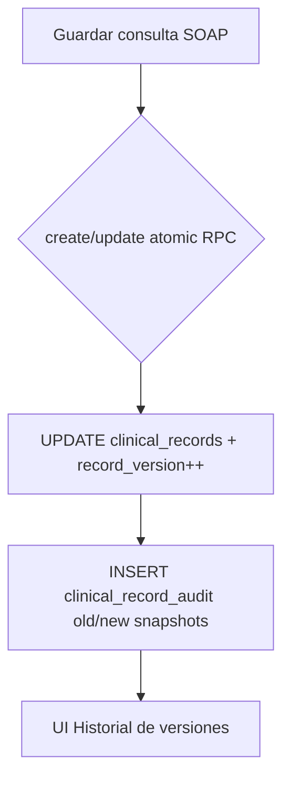

# Fase 6 — Integridad de historia clínica electrónica (Argentina)

**Proyecto:** DrFlow  
**Rama:** `compliance/argentina-monetization`  
**Fecha:** 2026-08-23  
**Alcance:** Staging/local. **No constituye certificación legal** ni validez de firma digital.

## Objetivo (PHASE 6)

Auditar la arquitectura de HC frente a implicancias técnicas de registros electrónicos (Ley 26.529 / 27.706 / Dec. 393/2023) y cerrar brechas donde el contenido clínico podía **sobrescribirse sin historial**.

## Mecanismo de versionado

DrFlow **no reemplaza** la fila actual por versiones separadas; usa **historial inmutable** en `clinical_record_audit` + contador `record_version` en `clinical_records`.

| Requisito | Implementación | Estado |
|-----------|----------------|--------|
| Autoría | `created_by`, `updated_by`, `clinical_record_audit.changed_by` | ✅ |
| Timestamp | `created_at`, `updated_at`, `changed_at` | ✅ |
| Trazabilidad | `clinical_record_audit` + `audit_logs` | ✅ |
| Integridad | RPC atómicos + triggers anti-mutación (048/055) | ✅ |
| Historial de modificaciones | `old_values` / `new_values` JSONB completos | ✅ |
| Versión monotónica | `record_version` (migración 130) | ✅ |
| Motivo de corrección | `change_reason` (columna + RPC param) | ✅ (opcional en UI) |
| Control de acceso | RLS `can_view_clinical` / `can_write_clinical` | ✅ |
| Recuperabilidad | Backups Supabase + exports habeas-data | ⚠️ Operativo |
| Firma digital legal | No implementada | 📋 Documentado aparte |

## Flujo de modificación



## Brechas cerradas en Fase 6

| Brecha | Corrección |
|--------|------------|
| `tryPersistStructuredColumns` actualizaba dx/tx sin auditoría | Patch auditado + bump `record_version` |
| Import HCE / FHIR / Teams JSONL sin fila de auditoría | `insertClinicalRecordCreationAudit()` |
| Reset masivo HC sin gate de entorno | Requiere `ALLOW_CLINICAL_HISTORY_RESET=true` |
| UI solo mostraba acción/fecha | Card muestra versión, campos cambiados, motivo |

## Brechas conocidas (documentadas)

| Riesgo | Mitigación actual | Recomendación |
|--------|-------------------|---------------|
| `clinical-reset` borra HC + audit CASCADE | Gate env + frase confirmación + `audit_logs` del reset | No habilitar en producción comercial |
| Imports legacy PDF/CSV con audit mínimo | `new_values.source` + marker | Migrar a `create_clinical_record_atomic` |
| Sin firma electrónica certificada | N/A | Proveedor REFEPS / certificadora si aplica |
| `change_reason` no obligatorio en formulario | Columna lista | UI futura para correcciones |

## Archivos clave

| Archivo | Rol |
|---------|-----|
| `supabase/migrations/130_clinical_record_integrity.sql` | `record_version`, `change_reason`, RPC update |
| `src/core/compliance/clinical-record-integrity.ts` | Helpers diff + audit import/patch |
| `src/features/historias/services/clinical-records.service.ts` | Patch auditado post-RPC legacy |
| `src/lib/actions/clinical-reset.ts` | Gate `ALLOW_CLINICAL_HISTORY_RESET` |
| `historia-detail-audit-card.tsx` | Visualización de versiones |

## Consulta SQL — historial de una consulta

```sql
SELECT
  changed_at,
  action,
  what,
  change_reason,
  old_values->>'record_version' AS version_before,
  new_values->>'record_version' AS version_after,
  profiles.full_name AS changed_by_name
FROM clinical_record_audit cra
LEFT JOIN profiles ON profiles.id = cra.changed_by
WHERE cra.clinical_record_id = :record_id
ORDER BY changed_at DESC;
```

## Tests

```bash
npx vitest run tests/clinical-record-integrity.test.ts
npx tsc --noEmit
```

## Veredicto técnico Fase 6

**Implementado:** versionado monotónico, historial inmutable por consulta, auditoría en imports, endurecimiento de reset, UI de historial.

**No afirmar:** validez legal de HC electrónica ni firma digital sin procedimiento regulatorio externo.
